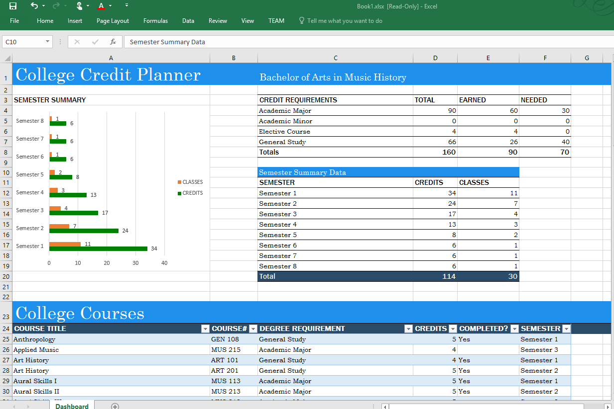
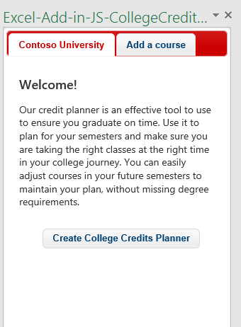

# Ejemplo del complemento del panel de tareas del rastreador de créditos universitarios para Excel 2016

_Se aplica a: Excel 2016_

Este complemento del panel de tareas muestra cómo crear un rastreador de créditos universitarios mediante las API de JavaScript de Excel 2016. Hay dos tipos: editor de texto y Visual Studio.

## Pruébelo
### Versión del editor de texto

La forma más sencilla de implementar y probar el complemento consiste en copiar los archivos en un recurso compartido de red.

1.  Cree una carpeta en un recurso compartido de red (por ejemplo, \\\MiRecursoCompartido\RastreadorCréditosUniversitarios) y copie todos los archivos en la carpeta del Editor de texto. 
2.  Edite el elemento <SourceLocation> del archivo de manifiesto para que apunte a la ubicación del recurso compartido del paso 1. 
3.  Copie el manifiesto (CollegeCreditsTrackerManifest.xml) en un recurso compartido de red (por ejemplo, \\\MiRecursoCompartido\\MisManifiestos).
4.  Agregue la ubicación del recurso compartido que contiene el manifiesto como un catálogo de aplicaciones de confianza en Excel.

    a. Inicie Excel y abra una hoja de cálculo en blanco.  
    
    b. Seleccione la pestaña **Archivo** y haga clic en **Opciones**.
    
    c. Haga clic en **Centro de confianza** y seleccione el botón **Configuración del Centro de confianza**.
    
    d. Seleccione **Catálogos de aplicaciones de confianza**.
    
    e. En el cuadro **URL de catálogo**, escriba la ruta de acceso al recurso compartido de red que haya creado en el paso 1 y luego elija **Agregar catálogo**.
    
   f. Active la casilla **Mostrar en el menú** y elija **Aceptar**. Aparecerá un mensaje para informarle de que la configuración se aplicará la próxima vez que inicie Office. 
        
5.  Pruebe y ejecute el complemento. 

    a. En la pestaña **Insertar** de Excel 2016, elija **Mis complementos**. 
    
    b. En el cuadro de diálogo **Complementos de Office**, seleccione **Carpeta compartida**.
    
    c. Seleccione **Ejemplo de rastreador de créditos universitarios**>**Insertar**. El complemento se abrirá en un panel de tareas a la derecha de la hoja de cálculo actual, como se muestra en la ilustración siguiente. 
        
    

    d. Haga clic en el botón **Crear planificador de créditos universitarios**. Esto crea el rastreador de créditos universitarios en la hoja activa, tal como se muestra en este diagrama. 
    
  

    e. Agregue algunos cursos mediante la pestaña **Agregar un curso** y vea cómo cambian dinámicamente los datos y el gráfico.
    
### Versión de Visual Studio
1.  Copie el proyecto en una carpeta local y abra Excel-Add-in-JS-CollegeCreditsTracker.sln en Visual Studio.
2.  Pulse F5 para crear e implementar el complemento de ejemplo. Excel se inicia y se abre el complemento en un panel de tareas a la derecha de una hoja de cálculo en blanco, como se muestra en la siguiente ilustración. 
        
   

3.  Haga clic en el botón **Create College Credits Planner** (Crear planificador de créditos universitarios). Esto crea el rastreador de créditos universitarios en la hoja activa tal y como se muestra en este diagrama. 
    
   
  
4. Agregue algunos cursos mediante la pestaña **Add a course** (Agregar un curso) y vea cómo cambian dinámicamente los datos y el gráfico.

### Obtener más información

Las API de JavaScript de Excel tienen mucho que ofrecer para el desarrollo de complementos. A continuación se muestran algunos de los recursos disponibles. 

1.  [Introducción a la programación de complementos de Excel](https://github.com/OfficeDev/office-js-docs/blob/master/excel/excel-add-ins-programming-overview.md)
2.  [Explorador de fragmentos de código para Excel](http://officesnippetexplorer.azurewebsites.net/#/snippets/excel)
3.  [Ejemplos de código de complementos de Excel](https://github.com/OfficeDev/office-js-docs/blob/master/excel/excel-add-ins-code-samples.md) 
4.  [Referencia de la API de JavaScript de complementos de Excel](https://github.com/OfficeDev/office-js-docs/blob/master/excel/excel-add-ins-javascript-reference.md)
5.  [Compilar el primer complemento de Excel](https://github.com/OfficeDev/office-js-docs/blob/master/excel/build-your-first-excel-add-in.md)
