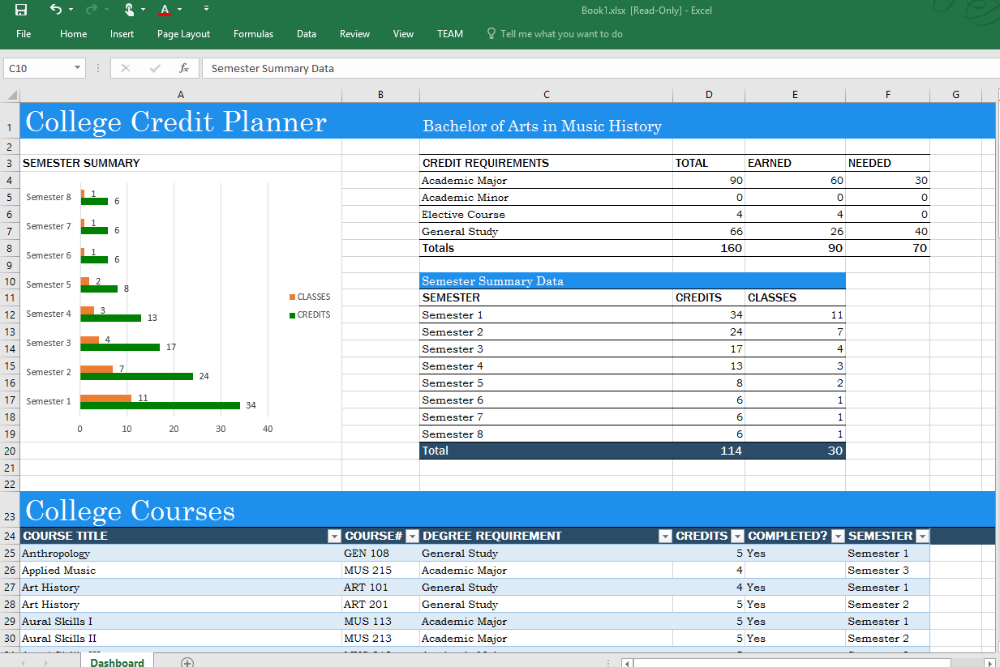

# Пример надстройки области задач для Excel 2016, позволяющей отслеживать зачеты в учебном заведении

Область применения: Excel 2016

Этот пример надстройки области задач показывает, как с помощью интерфейсов API JavaScript в Excel 2016 создать средство, отслеживающее зачеты в учебном заведении. Надстройка представлена в двух вариантах — для текстового редактора и для Visual Studio.

## Проверка
### Версия для текстового редактора

Самый простой способ развернуть и проверить надстройку — скопировать эти файлы в сетевую папку.

1.  Создайте дочернюю папку в сетевой папке (например, \\\MyShare\CollegeCreditsTracker) и скопируйте все файлы в папку Text Editor. 
2.  Измените элемент <SourceLocation> в файле манифеста, чтобы он указывал на общую папку, созданную на этапе 1. 
3.  Скопируйте манифест (CollegeCreditsTrackerManifest.xml) в сетевую папку (например, \\\MyShare\MyManifests).
4.  Добавьте общую папку, содержащую этот манифест, в качестве доверенного каталога приложений в Excel.

    А. Запустите Excel и откройте пустую электронную таблицу.  
    
    Б. Откройте вкладку **Файл** и выберите пункт **Параметры**.
    
    В. Выберите пункт **Центр управления безопасностью** и нажмите кнопку **Параметры центра управления безопасностью**.
    
    Г. Выберите пункт **Надежные каталоги приложений**.
    
    Д. В поле **URL-адрес каталога** введите путь к сетевой папке, созданной на шаге 1, и выберите элемент **Добавить каталог**.
    
   Установите флажок **Показывать в меню** и нажмите кнопку **ОК**. Появится сообщение о том, что параметры будут применены при следующем запуске Office. 
        
5.  Проверьте и запустите надстройку. 

    А. На вкладке **Вставка** в Excel 2016 выберите элемент **Мои надстройки**. 
    
    Б. В диалоговом окне **Надстройки Office** выберите элемент **Общая папка**.
    
    В. Выберите элементы **College Credits Tracker Sample** (Пример надстройки для отслеживания зачетов в учебном заведении) > **Вставить**. Надстройка откроется в области задач справа от текущего листа, как показано на рисунке ниже. 
        
    

    Г. Нажмите кнопку **Create College Credits Planner** (Создать планировщик зачетов в учебном заведении). На активном листе будут созданы таблицы и диаграмма для отслеживания зачетов в учебном заведении, как показано на этой схеме. 
    
  

    Д. Добавьте курсы на вкладке **Add a course** (Добавление курса) и обратите внимание на динамическое изменение данных таблиц и диаграммы.
    
### Версия для Visual Studio
1.  Скопируйте проект в локальную папку и откройте файл Excel-Add-in-JS-CollegeCreditsTracker.sln в Visual Studio.
2.  Нажмите клавишу F5, чтобы собрать и развернуть пример надстройки. Запустится Excel, а надстройка откроется в области задач справа от пустого листа, как показано на представленном ниже рисунке. 
        
   

3.  Нажмите кнопку **Create College Credits Planner** (Создать планировщик зачетов в учебном заведении). На активном листе будет создано средство отслеживания зачетов в учебном заведении, как показано на этой схеме. 
    
   
  
4. Добавьте курсы на вкладке **Add a course** (Добавление курса) и обратите внимание на динамическое изменение данных и диаграмм.

### Подробнее

Интерфейсы API JavaScript в Excel предоставляют существенно расширенные возможности для разработки надстроек. Ниже указаны лишь некоторые из доступных ресурсов. 

1.  [Общие сведения о создании надстроек Excel](https://github.com/OfficeDev/office-js-docs/blob/master/excel/excel-add-ins-programming-overview.md)
2.  [Обозреватель фрагментов кода для Excel](http://officesnippetexplorer.azurewebsites.net/#/snippets/excel)
3.  [Примеры кода надстроек Excel](https://github.com/OfficeDev/office-js-docs/blob/master/excel/excel-add-ins-code-samples.md) 
4.  [Справочник по API JavaScript для надстроек Excel](https://github.com/OfficeDev/office-js-docs/blob/master/excel/excel-add-ins-javascript-reference.md)
5.  [Создание первой надстройки Excel](https://github.com/OfficeDev/office-js-docs/blob/master/excel/build-your-first-excel-add-in.md)
